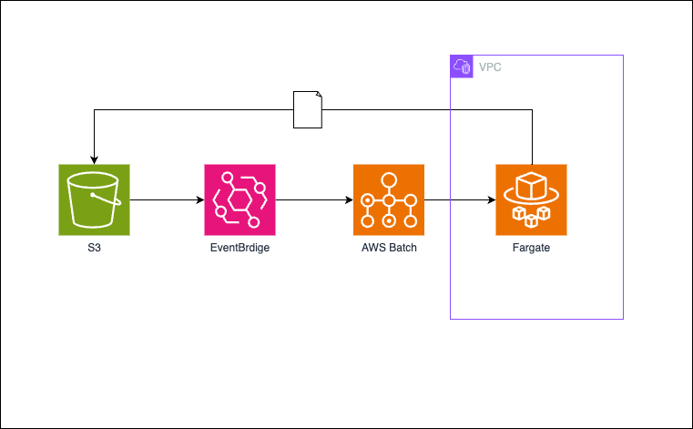

# sample-s3-batch-fargate
S3 + EventBridge + AWS Batch on Fargateのサンプル

## 構成

## 初期設定

- ルートディレクトリで`npm ci`を実行する
- cdkディレクトリで`npm ci`を実行する
- batchディレクトリで`npm ci`を実行する

## デプロイ

- ルートディレクトリで `npm run cdk:deploy:dev` でデプロイ
  - 途中で確認が入るので`y`を入力して進める
- 作成されたS3バケットに`original`フォルダを作成する
- 動作確認
    - S3バケットの`original`フォルダにファイルをアップロードする
    - AWS Batchのジョブが作成され、Fargateで実行されることを確認する
    - ジョブが正常に終了し、S3バケットにファイルがアップロードされることを確認する

## 削除

- ルートディレクトリで `npm run cdk:destroy:dev` で削除
- CloudWatch Logsにロググループが残っているので手動で削除する
    - `s-batch-fargate` で検索して削除する